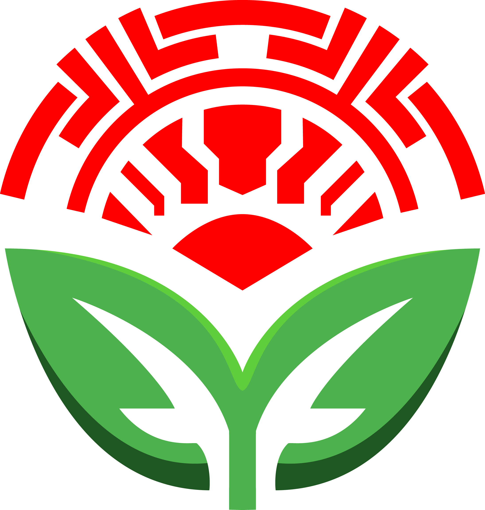

<!-- This readme was built off of this template: https://github.com/othneildrew/Best-README-Template/tree/master -->

<!-- PROJECT SHIELDS -->
<!--
*** I'm using markdown "reference style" links for readability.
*** Reference links are enclosed in brackets [ ] instead of parentheses ( ).
*** See the bottom of this document for the declaration of the reference variables  
*** https://www.markdownguide.org/basic-syntax/#reference-style-links
-->
[![Version][version-shield]][version-url]
[![Contributors][contributors-shield]][contributors-url]
[![License][license-shield]][license-url]

<!-- PROJECT LOGO -->
 

  

<h3 align="center">VerdanTech</h3>

  

    A garden productivity tool, agro-ecology model, and IOT platform
    for a sustainable and cooperative future.
     
    <a href=""><strong>Try it yourself »</strong></a>
     
     
    <a href="https://github.com/github_username/repo_name">Report Bug</a>
    ·
    <a href="https://github.com/github_username/repo_name/issues">Request Feature</a>
    ·
    <a href="link to discord">Discord</a>
    ·
    <a href="https://youtu.be/jGFHhRVdxRM">YouTube</a>
    ·
    <a href="link to patreon">Patreon</a>
     
  

VerdanTech is an open source software project best summarized as a fusion between:

- **Garden Productivity Engine**: An intricate and interactive model of agriculture which facilitates the data-driven planning of productive spaces and the collaborative coordination of labour at any scale.
- **Agro-Ecology Optimization Model**: A model which captures the relationship between agriculture and the broader ecological system, with the goal of producing a healthy abundance and diversity of food with minimal reliance on conditions of resource depletion and ecological destruction.
- **IoT Automation Suite**: An Internet-of-Things (IoT) platform which serves as an extensible interface for integration with external APIs. Alongside the platform is a set of embedded devices designed to automate the process of obtaining measurements and executing tasks.

The goal of VerdanTech is to provide software tools that make it easier to collaboratively plan, track, optimize, and automate bio-diverse agriculture systems at any scale, from small backyard container gardens to a multi-acre community plots. 

VerdanTech has been in development since late 2022, or early 2021 if we count the [initial attempt](https://www.youtube.com/watch?v=w0TwPI7bLp8&ab_channel=TotalVeganicFuturism) at a similar idea. VerdanTech is built with [sentientist values](https://sentientism.info/) in mind, and as such does not consider sentient beings as acceptable subjects of exploitation for food or any other purpose.

The project currently is made up of several repositories:
- [Outline](https://github.com/VerdanTech/VerdanTech-Outline) contains high level conceptual overviews and design documents.
- [Backend](https://github.com/VerdanTech/VerdanTech-Backend) contains a Python HTTP API.
- [Frontend](https://github.com/VerdanTech/VerdanTech-Frontend) contains a Svelte-Kit static adapter application. 
- [Deployment](https://github.com/VerdanTech/VerdanTech-Deployment) contains application deployment orchestration. 
- [Drip](https://github.com/VerdanTech/VerdanTech-Drip) contains an embedded IOT irrigation controller.

<!--- See the video introduction to VerdanTech here: --->
<!---  --->

 

<!-- TABLE OF CONTENTS -->

    
Table of Contents

    <ul>
        <li>
            <a href="#background">Background</a>
            <ul>
                <li>
                    <a href="#the-problem">The Problem</a>
                </li>
                <li>
                    <a href="#the-solution">The Solution</a>
                </li>
            </ul>
        </li>
        <li>
            <a href="#features">Features</a>
            <ul>
                <li>
                    <a href="#completed">Completed</a>
                </li>
                <li>
                    <a href="#in-progress">In Progress</a>
                </li>
                <li>
                    <a href="#planned">Planned</a>
                </li>
            </ul>
        </li>
        <li>
            <a href="#deployment">Deployment</a>
        </li>
        <li>
            <a href="#codebase">Codebase</a>
            <ul>
                <li>
                    <a href="#built-with">Built With</a>
                </li>
                <li>
                    <a href="#architecture">Architecture</a>
                </li>
                <li>
                    <a href="#download-and-installation">Download and Installation</a>
                </li>
                <li>
                    <a href="#backend">Backend</a>
                    <ul>
                        <li>
                            <a href="#background-1">Background</a>
                        </li>
                        <li>
                            <a href="#documentation">Documentation</a>
                        </li>
                        <li>
                            <a href="#contributing">Contributing</a>
                        </li>
                    </ul>
                </li>
                <li>
                    <a href="#frontend">Frontend</a>
                    <ul>
                        <li>
                            <a href="#background-2">Background</a>
                        </li>
                        <li>
                            <a href="#documentation-1">Documentation</a>
                        </li>
                        <li>
                            <a href="#contributing-1">Contributing</a>
                        </li>
                    </ul>
                </li>
            </ul>
        </li>
        <li>
            <a href="#community">Community</a>
        </li>
    </ul>

# Background

*This section highlights the problems that VerdanTech aims to solve and the nature of the solutions.*

## Agriculture

Dictionary.com [defines agriculture as](https://www.dictionary.com/browse/agriculture):
> the science, art, or occupation concerned with cultivating land, raising crops, and feeding, breeding, and raising livestock; farming.

VerdanTech is built with [sentientist values](https://sentientism.info/) in mind, and as such does not consider sentient beings as acceptable subjects of exploitation for food or any other purpose. As a result, the word agriculture in the context of any VerdanTech documentation uses this definition:
> the science, art, or occupation concerned with cultivating land and raising crops; farming.

The specific term "animal agriculture" retains its meaning. 

## Ecology

Merriam Webster [defines ecology as](https://www.merriam-webster.com/dictionary/ecology)
> a branch of science concerned with the interrelationship of organisms and their environments, the totality or pattern of relations between organisms and their environment.

In our world today, the relationship between ecology and human society is more important than ever. We rely on ecosystem systems for services that are vital to our existence. The Millenium Ecosystem Assessment provides [four categories](https://earth.org/what-are-ecosystem-services/) of ecosystem services:

- **Provisioning services** produce material resources such as food, water, fibers, oil, and minerals. 
- **Regulating services** maintain favorable ecological, climate, and other conditions, such as climate regulation, flood protection, pollination, and water purification. 
- **Supporting services** maintain the foundation of a functioning ecosytem, including the water cycle, nutrient cycle, and biodiversity.  
- **Cultural services** provide non-material benefits such as spiritual, intellectual, recreational, and aesthetic values.

Despite our reliance on these services, we maintain relationships with the ecological systems responsible for them that are largely unsustainable. Keeping in mind the broad and varied scope of ecosystem services, a society cannot be sustained when its consumption of resources or emissions of waste exceed the regenerative or absorbative capacities of its environment. A society of these conditions undermines not only its own wellbeing but also that of fellow inhabitants and the health of the ecosystem itself. 

Our environment is planet Earth, and the combined ecological impact of all our systems of extraction, production, pollution, and emission amounts to a truly devastating level of resource depletion, biosphere destruction, climate change, and more. The situation is intolerable. It falls on us to figure out how we need to adapt and then to undertake it.

A truly sustainable society requires many adaptations. Some are technological, including changes to what resources we depend on and what procceses we use to achieve our goals. Technological adaptations involve some combination of meeting our energy and material demands through sustainable resources and finding ways to reduce the amount of those resources required for the services we demand. Other adaptations are social, including changes to what our goals are and thus what services we demand and how we organize ourselves to meet them. Social adaptations involve the creation of human organization centered around solidarity, equality, and cooperation towards collective success and the equal interest of all individuals across species and generations.

Almost all of these adaptations are interconnected, and massive in scope. VerdanTech focuses specifically on agriculture and its relation to ecology and the organization of human labour.

### Modern Industrial Agriculture and the Ecological Alternative

Our modern industrial agriculture system leaves much to be desired in the way of ecological sustainability. To summarize this article titled [How sustainable agriculture can address the environmental and human health harms of industrial agriculture](https://www.ncbi.nlm.nih.gov/pmc/articles/PMC1240832/):
- The intensive use of monocultures, synthetic fertilizers, and pesticides causes biodiversity destruction.
- A reliance on non-renewable fossil fuels for the production of chemical inputs and mechanical work, as well as the use of renewable resources such as soil and water faster than their rate of regeneration, creates a dependency on unsustainable conditions of ecological destruction. 
- The monopolization of the means of agriculture production leads to a social rift between the needs and wants of consumers and the livelihoods of producers. 

In other words, the modern industrial agriculture system is dependent on systems which undermini the conditions required for its own existence and that of society. 
 
The application of ecological analysis to agriculture highlights a clear need for a transition to sustainable agriculture as a core sector of sustainable development. The concept of agro-ecology seeks to provide a framework for understanding the path that we need to take. The United Nations Food and Agriculture Organization (FAO) [defines agro-ecology as](https://www.fao.org/3/i9037en/i9037en.pdf):
>Agroecology is an integrated approach that simultaneously applies ecological and social concepts and principles to the design and management of food and agricultural systems. It seeks to optimize the interactions between plants, animals, humans and the environment while taking into consideration the social aspects that need to be addressed for a sustainable and fair food system. Rather than tweaking the practices of unsustainable agricultural systems, agroecology seeks to transform food and agricultural systems, addressing the root causes of problems in an integrated way and providing holistic and long-term solutions. [Agroecology] is based on bottom-up and territorial processes, helping to deliver contextualised solutions to local problems. Agroecological innovations are based on the co-creation of knowledge, combining science with the traditional, practical and local knowledge of producers. By enhancing their autonomy and adaptive capacity, agroecology empowers producers and communities as key agents of change.

As a result, a transition to a sustainable agriculture system will require a few main challenges: 

Integration with natural ecosystem dynamics and less use of non-renewable energy requires more complex, bio-diverse systems which are harder to cognitively and physically manage.
Using less fossil fuels implies a labour transition.
We need closer connections between producers and consumers

Meaning that we need more labour, and the labour needs to be more ecologically skilled

- The destruction of bio-diversity 

- The consumption of fossil fuels, water, and fertile soil at unsustainable rates.
- The destruction of bio-diversity 
- Pollution 

The adaptations of agro-ecology are necessary to solve a multitude of problems with how our modern agriculture system fails us:
- Degradation of biodiversity, simplification
- Mechanization, simplification
- 

general agriculture: https://www.ncbi.nlm.nih.gov/pmc/articles/PMC1240832/
labour transition: https://www.frontiersin.org/articles/10.3389/fsufs.2019.00096/full
land use strategies: https://www.sciencedirect.com/science/article/abs/pii/S2211912412000363

## How could a technological innovation best empower us to adapt?

***WIP***

Minimize the cognitive load associated with planning, tracking, optimizing, and automating an agro-ecological system.

being able to expirement systematically with various types of growing systemr

## What is VerdanTech?

***WIP***

From the FAO on [what makes agroecology distinct?](https://www.fao.org/3/i9037en/i9037en.pdf):
> Agroecology is fundamentally different from other approaches to sustainable development. It is based on bottom-up and territorial processes, helping to deliver contextualised solutions to local problems. Agroecological innovations are based on the co-creation of knowledge, combining science with the traditional, practical and local knowledge of producers. By enhancing their autonomy and adaptive capacity, agroecology empowers producers and communities as key agents of change.

VerdanTech aims to be a tool that enhances the adaptive capacity through minimizing the amount of knowledge, experience, time, and resources to transform a local biosystem into the optimal agroecology plot. 

> Rather than tweaking the practices of unsustainable agricultural systems, agroecology seeks to transform food and agricultural systems, addressing the root causes of problems in an integrated way and providing holistic and long-term solutions. This includes an explicit focus on social and economic dimensions of food systems. Agroecology places a strong focus on the rights of women, youth and indigenous peoples.

In terms of general garden productivity

In terms of agro ecology,
- cocreation of knowledge, enhancing adaptability
- optimal spatial and temporal diversity planning

## What are the core values of VerdanTech as a project?

***WIP***

## What are the core values of VerdanTech as a software system?

***WIP***

<a href="#readme-top">back to top</a>

# Codebase

***WIP***

## Built With

* [![Svelte][Svelte.dev]][Svelte-url]
[

## Architecture

The application implements a decoupled backend/frontent arhitecture. The backend is an asynchronous python3. running on uvicore, and the frontend is a SvelteKit spa-mode static file generator with Skeleton UI.

## Download and Installation

Recommended VS code theme: Solarized Dark

## Backend

### Background

The python backend implements a clean architecture pattern, meaning that the functions of the application are segregated in a way that minimizes coupling. Quick summaries for the layers:
- The domain layer holds the core business logic and is made up of four components: Entities, which are objects with IDs and individuality that represent concepts in the problem space, RootEntities which are entities that make up Collections of documents or SQL tables in the database, meaning they represent consistency boundaries of data, value objects, which are ID-less and immutable, and represent individual-less states, and services, which encapsulate core logic in the problem domain that can't be relegated to any of the other options. All these concepts are implemented using native Python dataclasses. The domain layer also holds interfaces that are relied upon by the domain layer and application layer
- The application layer orchestrates the domain layer and connects it to implementations of the interfaces. The application layer has two parts: the operaions sections, which are high level application functions and make up the main API (are-one to one with http API routes), and the services sections, which comprise more granular orchestrations of the domain logic and are called in the operations.
- The infrastrure contains implementations of the domain service interfaces, such as database implementations of the repository interface. The only repository in use so far is a MongoDB Motor (async pymongo) implementation. The repository abstraction makes it possible to use different implementations in the future, but I havent investigated the potential compatibility with a sql database (plan to stick with mongo)
- The API layer is the http and websocket wrapping around the application layer, and is implemented using the Litestar 

### Documentation

### Contributing

## Frontend

### Background

Why I chose Svelte and Skeleton.

### Documentation

### Contributing

# Community

<!-- MARKDOWN LINKS & IMAGES -->
<!-- https://www.markdownguide.org/basic-syntax/#reference-style-links -->

<!-- IN-REPO -->
[version-shield]: https://img.shields.io/badge/version-0.0.1-blue?style=for-the-badge
[version-url]: https://github.com/nathanielarking/Autonomous-Agriculture/releases
[contributors-shield]: https://img.shields.io/github/contributors/nathanielarking/VerdanTech.svg?style=for-the-badge
[contributors-url]: https://github.com/nathanielarking/VerdanTech/graphs/contributors
[stars-shield]: https://img.shields.io/github/stars/nathanielarking/VerdanTech.svg?style=for-the-badge
[stars-url]: https://github.com/nathanielarking/VerdanTech/stargazers
[issues-shield]: https://img.shields.io/github/issues/nathanielarking/VerdanTech.svg?style=for-the-badge
[issues-url]: https://github.com/nathanielarking/VerdanTech/issues
[prs-shield]: https://img.shields.io/github/issues-pr/nathanielarking/VerdanTech.svg?style=for-the-badge
[prs-url]: https://github.com/nathanielarking/VerdanTech/pulls
[license-shield]: https://img.shields.io/github/license/nathanielarking/VerdanTech.svg?style=for-the-badge
[license-url]: https://github.com/nathanielarking/VerdanTech/LICENSE.txt

<!-- OTHER-REPO -->
[devices]: https://github.com/nathanielarking/VerdanTech-Devices

<!-- EXTERNAL -->

[Svelte.dev]: https://img.shields.io/badge/Svelte-4A4A55?style=for-the-badge&logo=svelte&logoColor=FF3E00
[Svelte-url]: https://svelte.dev/
